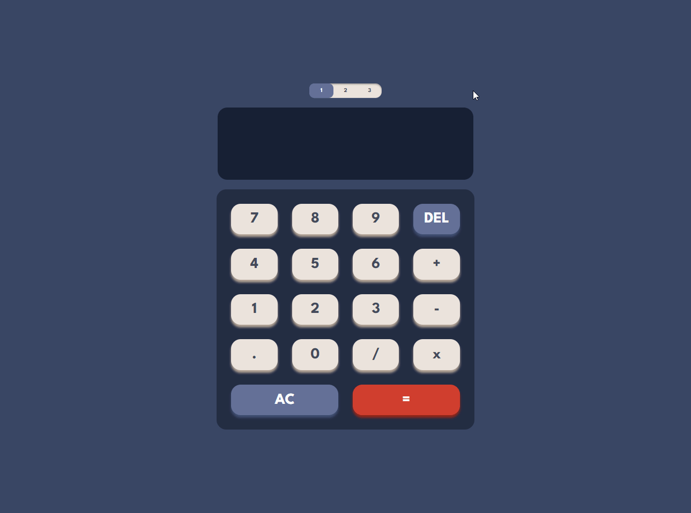

# ReactJs Calculator w/ Theme Switcher

This is a calculator created using ReactJs + Styled Components with the design from the [Frontend Mentor Challenge](https://www.frontendmentor.io/challenges/calculator-app-9lteq5N29). 

## Table of contents

- [Overview](#overview)
  - [Screenshot](#screenshot)
  - [Links](#links)
- [My process](#my-process)
  - [Built with](#built-with)
  - [What I learned](#what-i-learned)
  - [Continued development](#continued-development)

## Overview

### Requirements

Users should be able to:

- Perform mathmatical operations like addition, subtraction, multiplication, and division
- Adjust the color theme based on their preference
- See the first typed number while the second is been typed before the operation is done

### Screenshot

### Links

- [Github URL](https://github.com/PedroAlexSMC/Calculator-ReactJs)
- [Live Site URL](https://calculator-react-c1563ux4z-pedroalexsmc.vercel.app/)

## My process

### Built with

- React useReduce Hook
- [React](https://reactjs.org/) - JS library
- [Styled Components](https://styled-components.com/) - Styling library

### What I learned

It was an awesome oportunity to practice the useReduce Hook, setting up actions and managing the states with reducers. It was also my first project using styled components for the theme management and general styling.

### Continued development

The next step of this project is to implement responsiveness to port it to mobile view. 
